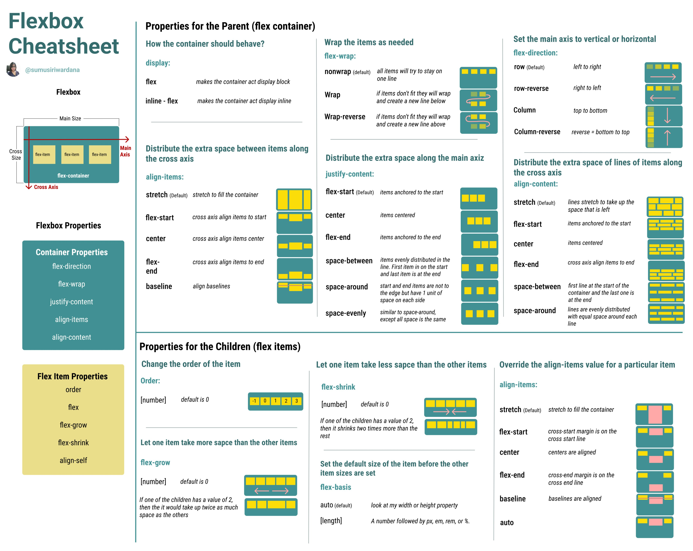

[Webseite um die Flexboxeinstellungen zu testen](https://flexbox.tech/)

### Beispielcode für die Verwendung der position für ein Element
- static = normal (Standardwert - Man kann nicht mit top, left usw. verschieben und gilt deshalb als nicht positioniert)
- relative = verschiebbar innerhalb des Flusses (Element bleibt im Fluss, kann aber relativ zur ursprünglichen Position verschoben werden)
- absolute = relativ zum Vorfahren positioniert (Element wird aus dem normalen Fluss entfernt und orientiert sich an dem Parent Element)
- fixed = relativ zum Bildschirm, bleibt immer sichtbar (Element wird relativ zum gesamten Browserfenster (Viewport) positioniert, es bleibt beim Scrollen an der selben Stelle sichtbar)
- sticky = fließt normal, bleibt aber kleben beim Scrollen (Element bewegt sich normal mit dem Inhalt , Wird eine bestimmte Position erreicht (z.B. top: 0), bleibt es dort kleben, allerdings nur innerhalb eines Parent Elements, das gescrollt werden kann z.B. ein Container mit overflow: auto)
```html
<!DOCTYPE html>
<html lang="en">
  <head>
    <meta charset="UTF-8" />
    <meta name="viewport" content="width=device-width, initial-scale=1.0" />
    <title>Document</title>
    <style>
      .box {
        width: 100px;
        height: 100px;
        background: lightcoral;
        margin: 10px;
      }
      .static-box {
        position: static;
        background-color: aliceblue;
      }
      .relative-box {
        position: relative;
        background-color: aqua;
        top: 10px;
        left: 10px;
      }
      .absolute-container {
        position: relative;
        height: 150px;
        background-color: bisque;
      }
      .absolute-box {
        position: absolute;
        top: 10px;
        right: 10px;
        background-color: lightgreen;
      }
      .fixed-box {
        position: fixed;
        bottom: 150px;
        left: 10px;
        background-color: blueviolet;
      }
      .sticky-container {
        position: relative;
        overflow: auto;
        height: 150px;
        border: 1px solid #693f29;
      }
      .sticky-box {
        position: sticky;
        top: 0;
        background-color: lightpink;
        padding: 5px;
      }
      .z-container {
        position: relative;
        height: 120px;
        margin: 20px 0;
      }
      .z-box1,
      .z-box2 {
        position: absolute;
        width: 80px;
        height: 80px;
        opacity: 0.8;
      }
      .z-box1 {
        background-color: steelblue;
        top: 10px;
        left: 10px;
        z-index: 1;
      }
      .z-box2 {
        background-color: salmon;
        top: 40px;
        left: 40px;
        z-index: 2;
      }
      .container {
        display: flex;
      }
      button {
        background-color: aqua;
      }
      .text-left {
        text-align: left;
      }
      .text-center {
        text-align: center;
      }
      .text-right {
        text-align: right;
      }
    </style>
  </head>
  <body>
    <h1>CSS Eigenschaften</h1>
    <h2>CSS Position</h2>
    <section>
      <p>
        Mit der <code>position</code>-Eigenschaft bestimmst du, wie ein Element
        auf der Seite platziert wird. Dabei geht es darum, ob und wie das
        Element verschoben werden kann. Hier die fünf möglichen Werte im Detail:
      </p>

      <div class="box static-box">
        static<br />
        (Standard)
      </div>
      <div class="box relative-box">
        relative<br />
        verschoben
      </div>
      <div class="box static-box">
        static<br />
        (Standard)
      </div>
      <div class="absolute-container">
        <div class="box absolute-box">
          absolute <br />
          (innerhalb Container)
        </div>
      </div>
      <div class="box fixed-box">
        fixed <br />
        (fest im Fenster)
      </div>
      <div class="sticky-container">
        <div class="sticky-box">
          sticky <br />
          (klebt beim scrollen)
        </div>
        <p>Scroll diesen Bereich, um das Verhalten zu testen</p>
        <p>Inhalt...</p>
        <p>Inhalt...</p>
        <p>Inhalt...</p>
        <p>Inhalt...</p>
        <p>Inhalt...</p>
      </div>
    </section>

    <p>Inhalt außerhalb des Sticky containers</p>
    <p>Inhalt außerhalb des Sticky containers</p>
    <p>Inhalt außerhalb des Sticky containers</p>
    <p>Inhalt außerhalb des Sticky containers</p>
    <p>Inhalt außerhalb des Sticky containers</p>

    <div class="z-container">
      <div class="z-box1">z-index: 1</div>
      <div class="z-box2">z-index: 2</div>
    </div>

    <h2>CSS text-align</h2>
    <p>
      Mit <code>text-align</code> richtest du Text innerhalb eines Blockelements
      horizontal aus.
    </p>
    <div class="text-left">linksbündig (standard)</div>
    <div class="text-center">zentriert</div>
    <div class="text-right">rechtsbündig</div>
  </body>
</html>
```

### Beispielcode für die Verwendung  der Flex-Box
#### Flexbox Cheatsheet

- direction: row + nowrap
justify-content: Änderungen in der horizontalen
align-items: Änderungen in der vertikalen
align-content: keine Auswirkung

- direction: column + nowrap
justify-content: Änderungen in der vertikalen
align-items: Änderungen in der horizontalen
align-content:  keine Änderungen

Kurzform:
```css
flex: flex-grow | flex-shrink | flex-basis
z.B. 
flex: 0 1 auto
```

```css
#container {
    display: flex;
    flex-direction: row;
    flex-wrap: wrap;
    justify-content: flex-end;
    align-content: flex-end; /* Wirkt nur, wenn flex-wrap=wrap und mehrere Zeilen vorhanden sind*/
    align-items: flex-end; /* ist bei flex-wrap= nowrap aktiv */
    height: 100vh;
    width: 100vw;
    gap: 16px;
}
.box {
    width: 4rem;
    aspect-ratio: 1 / 1;
    background-color: brown;
    margin: 10px;
}
.box:nth-child(1) {
        background-color: aquamarine;
        flex-basis: 10vw;

        /* Legt die Reihenfolge des Flex-Items fest. */
        order: 0; 

        /* wie stark ein Flex-Item im Verhältnis zu den anderen wachsen soll, wenn zusätzlicher Raum vorhanden ist. */
        flex-grow: 0; 

        /* Definiert, wie ein Flex-Item schrumpfen soll, wenn nicht genügend Platz vorhanden ist. Bei 0 bleibt es 
        bei seiner Größe*/
        flex-shrink: 1; 

        /* Legt die Ausgangsgröße eines Flex-Items fest, bevor zusätzlicher Raum verteilt wird. */
        flex-basis: auto; 

        /*(nur bei nowrap)  Was es macht: Legt die Startgröße des Elements im Flex-Container fest. auto bedeutet: 
        Nutze die Größe des Inhalts oder CSS-Größenangaben (wie width, height), um die Startgröße zu bestimmen.*/
        align-self: auto; 
}
```
