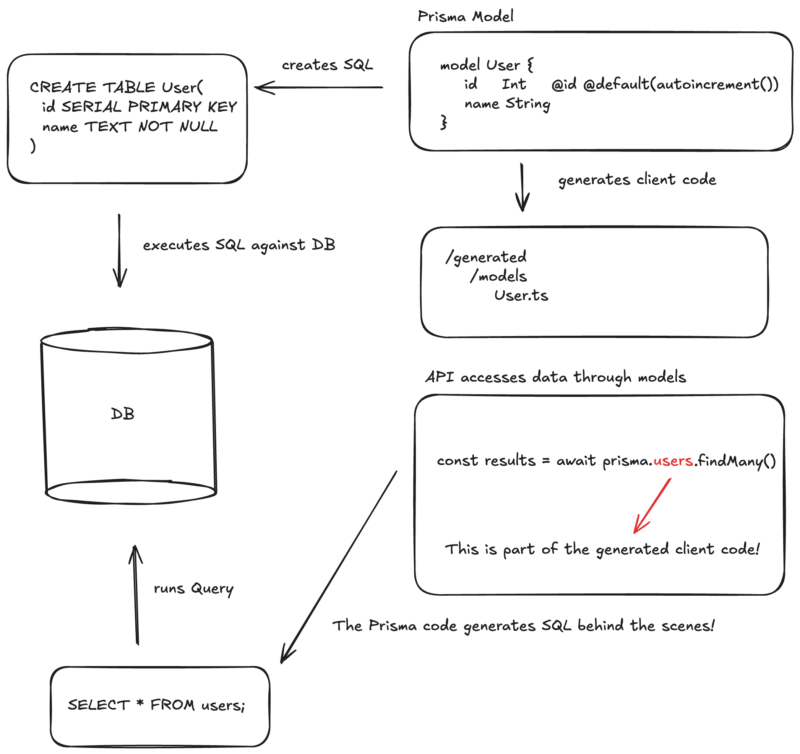

[Prisma Demo API](https://github.com/dci-fbw-wd-25-d02/prisma-demo)

## What is an ORM?

An ORM is a library (package) that allows us to abstract away concrete SQL syntax when we access our data source.

Instead, we access our data in a typesafe manner by accessing methods provided by the ORM. Usually ORMs can create nested objects / arrays as output, which is easier to use in Javascript than the flat tables SQL queries return.

## Example

With the [`postgres` Query Builder](https://www.npmjs.com/package/postgres) we would access 1:N like this:

```js
const results = await sql`
    SELECT d.id, d.name, m.title, m.id AS movie_id FROM directors d
    LEFT JOIN movies d ON d.id = m.director_id;
   `;
];
```

This returns the following data structure:

```json
[
  {
    "id": 1,
    "name": "Hitchcock",
    "movie_id": 1,
    "title": "Psycho",
  },
  {
    "id": 1,
    "name": "Hitchcock",
    "movie_id": 2,
    "title": "Rear Window",
  },
  {
    "id": 2,
    "name": "Spielberg",
    "movie_id": 3,
    "title": "E.T.",
  },
];
```

Notice that "Hitchcock" appears twice, we would have to manually transform this structure to create director objects with a `movies` prop, which is usually what we want to have in Javascript.

With Prisma you would access the data like this:

```js
const results = await prisma.directors.findMany({
  include: {
    movies: true,
  },
});
```

This would return the following data structure:

```json
[
  {
    "id": 1,
    "name": "Hitchcock",
    "movies": [
      {
        "id": 1,
        "title": "Psycho"
      },
      {
        "id": 2,
        "title": "Rear Window"
      }
    ]
  },
  {
    "id": 2,
    "name": "Spielberg",
    "movies": [
      {
        "id": 3,
        "title": "E.T."
      }
    ]
  }
]
```

Notice that we did not use any SQL syntax to perform the query.
We also get a typesafe result set with a nested data structure.

## How does the ORM perform its magic?

To make this work, the ORM has to be the "source of truth" for our data structure.

That means that we define/configure our data structure in the ORM instead of using `CREATE TABLE` statements that we run against the database directly.

As the ORM now knows our data structure, it can do two things:

1. Generate `CREATE TABLE` statements that it can run against the DB.
2. Generate a typesafe Javascript data model that we can use to access the data (In Prisma, this is called the `Prisma Client`).

Prisma comes with a `CLI` (command line interface) we can use to generate the client code or to apply the data structure to our database.

In our API, we use the generated Prisma Client code to access the data:

```js
const results = await prisma.movies.findMany({
  where: {
    title: "Titanic",
  },
});
```

See the [Prisma Documentation](https://www.prisma.io/docs/getting-started/prisma-orm/quickstart/postgresql) for further info on how to create the data model and how to access the data.

Here is an overview of the architecture:



##### Eigene Installation

##### .env
```
DATABASE_URL="postgresql://ralf@localhost:5432/shop"
```
##### prisma.config.ts
```
import { defineConfig } from "prisma/config";

export default defineConfig({
  schema: "prisma/schema.prisma",
  migrations: {
    path: "prisma/migrations",
  },
  datasource: {
    url: "postgresql://ralf@localhost:5432/shop",
  },
});
```
##### schema.prisma
```
generator client {
  provider = "prisma-client-js"
//  output   = "../generated/prisma"
}

datasource db {
  provider = "postgresql"
}

model Category {
  id     Int     @id @default(autoincrement())
  name   String  @unique
  products Products[]
}

model Products {
  id     Int     @id @default(autoincrement())
  name   String  @unique
  price  Int
  category Category @relation(fields: [category_id], references: [id])
  category_id Int
}
```
##### index.ts
```
import express from "express";
import { PrismaClient } from "./generated/prisma/client";
import { PrismaPg } from "@prisma/adapter-pg";

const connectionString = `${process.env.DATABASE_URL}`;

const adapter = new PrismaPg({ connectionString });
const prisma = new PrismaClient({
  adapter,
  log: ["query", "info", "warn", "error"],
});

const app = express();
const port = 3002;

app.use(express.json());

app.get("/products", async (req, res) => {
  try {
    const products = await prisma.products.findMany({
      include: { category: true },
    });
    res.json(products);
  } catch (error) {
    res.status(500).json({ error: "Fehler beim Laden der Produkte" });
  }
});

app.listen(port, () => {
  console.log(`Server läuft auf http://localhost:${port}`);
});
```
```
bun init
bun install prisma @types/node @types/pg --save-dev 
bun install @prisma/client @prisma/adapter-pg pg

bunx prisma
bunx prisma init --datasource-provider postgresql --output ../generated/prisma
bunx prisma migrate dev --name init
bunx prisma generate
```